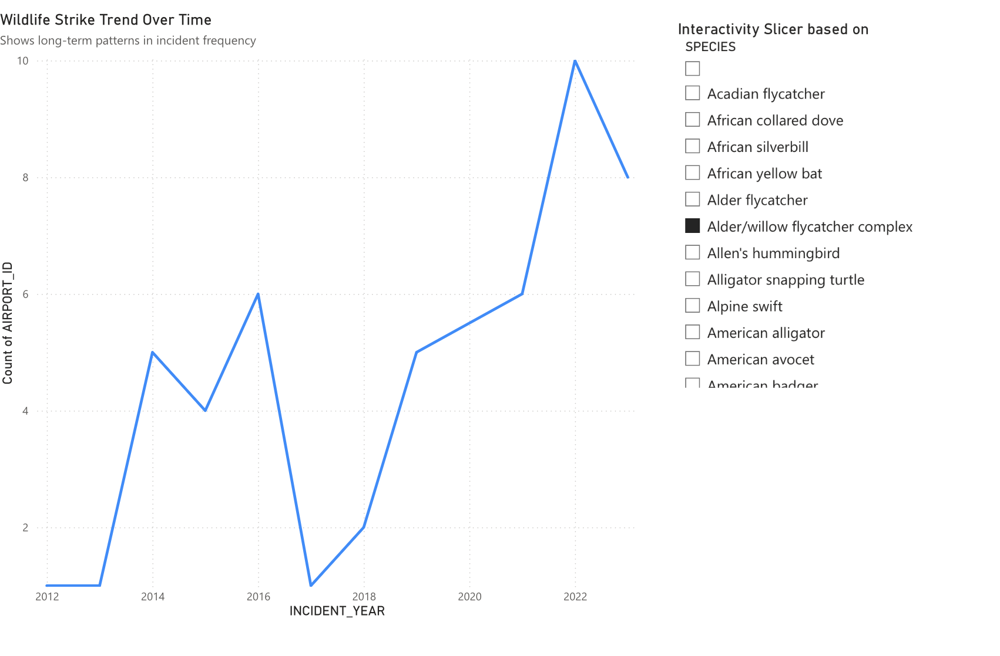
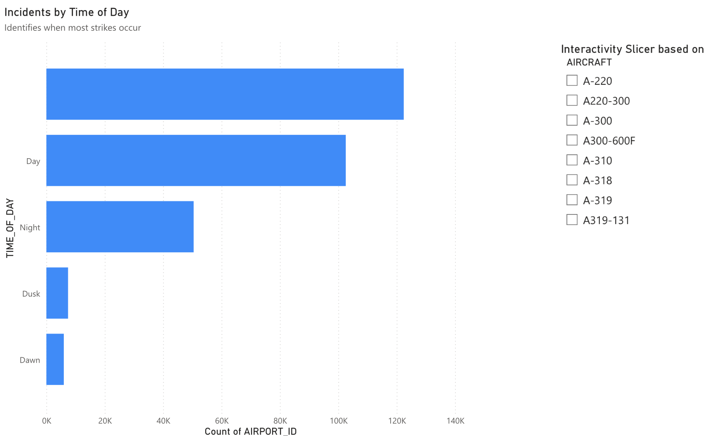
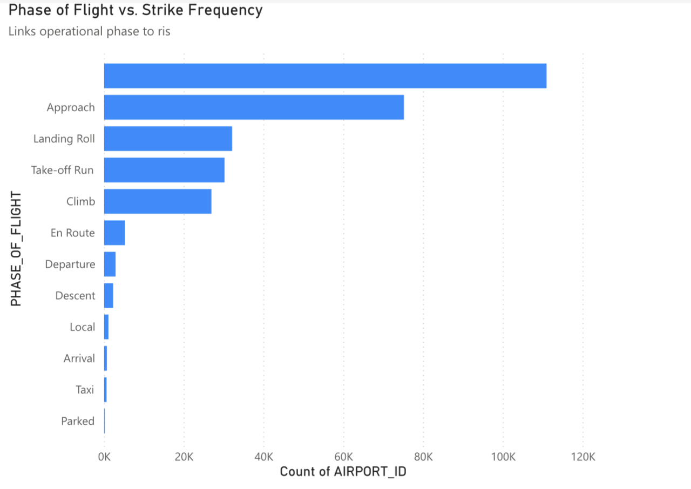
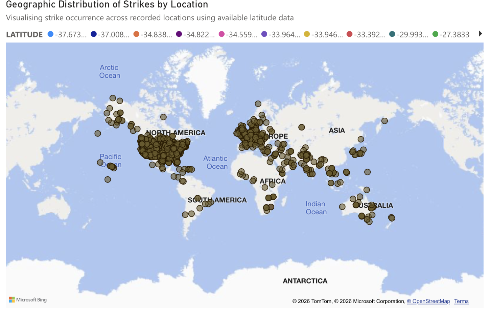

# 📊 Wildlife Strike Analysis – Power BI Dashboard

## Project Context
This project was completed as part of an **MSc Business Analytics coursework** focused on designing a functional, user-centred Power BI dashboard.

The objective was to translate a complex aviation dataset into **clear, decision-oriented insights** using effective data visualisation principles and interactivity.

The emphasis of this project was not only technical accuracy, but also **dashboard design, audience relevance, and analytical storytelling**, in line with real-world consulting and analytics practices.

---

## Business Problem
Wildlife strikes present significant **operational, safety, and financial risks** to the aviation industry.

Airports and aviation authorities require visibility into:
- When incidents occur  
- Where they are concentrated  
- Which operational phases are most exposed  

This dashboard addresses the following business questions:
- Are wildlife strikes increasing over time?
- During which times of day do strikes most frequently occur?
- Which phases of flight are most exposed to strike risk?
- Are there geographic or regional strike hotspots?

---

## Dataset
The analysis uses an aviation wildlife strike dataset containing reported incidents across multiple years.

Key variables include:
- Incident year  
- Time of day  
- Phase of flight  
- Aircraft type  
- Geographic location  
- Species involved  

Basic data preparation, cleaning, and field formatting were performed directly within **Power BI**.

---

## Key Insights Visualised

### 1️⃣ Wildlife Strikes Trend Over Time
Highlights long-term patterns in wildlife strike frequency and identifies periods of increasing operational risk.

---

### 2️⃣ Incidents by Time of Day
Shows when wildlife strikes most commonly occur, supporting time-based risk mitigation and operational planning.

---

### 3️⃣ Phase of Flight vs Strike Frequency
Identifies the operational phases most exposed to wildlife strike risk, particularly during critical flight moments such as approach and landing.

---

### 4️⃣ Geographic Distribution of Wildlife Strikes
A map-based visualisation highlighting spatial concentration of wildlife strikes and geographic hotspots.

---

## Dashboard Interactivity
The Power BI dashboard includes **interactive slicers** that allow users to:
- Filter incidents by aircraft type
- Explore strike patterns by species
- Focus on specific operational dimensions

These interactions support **exploratory analysis** without overwhelming the user.

---

## Tools & Techniques
- Power BI (dashboard design and interactivity)
- Time-series analysis
- Categorical comparison
- Geospatial visualisation
- User-driven slicers and filters

---

## Target Audience
- Aviation safety analysts  
- Airport operations teams  
- Risk and compliance stakeholders  
- Decision-makers involved in operational risk management  

---

## Design Approach
- Line charts used for trends over time  
- Bar charts used for categorical comparisons  
- Maps used for geographic patterns  
- Clean layout and minimal colour palette to enhance readability  
- Clear titles and annotations to guide interpretation  
- Interactivity added only where it adds analytical value  

---

## Confidentiality Note
This repository contains **visual outputs and analytical summaries only**.

The original dataset and full academic submission files are excluded to respect confidentiality and academic integrity requirements.

---

## Author
**Mahnoor Baloch**  
*MSc Business Analytics*
